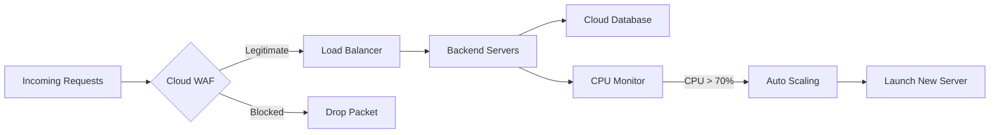
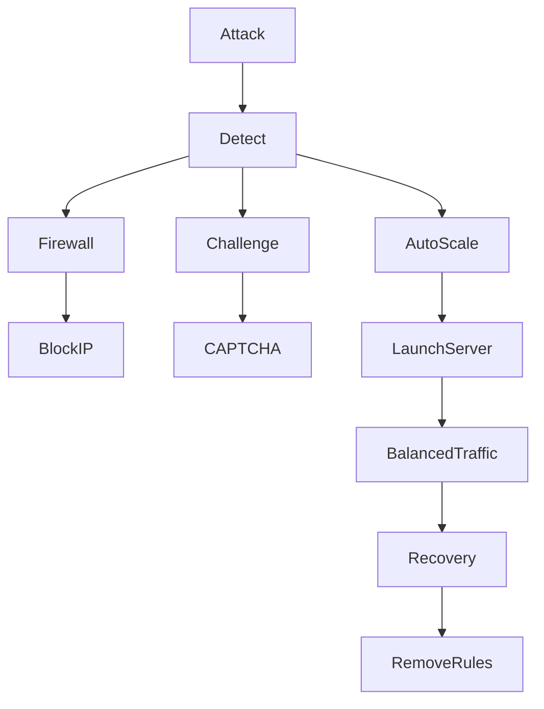

# ☁️ Cloud Shield – DDoS Detection, Mitigation & Elastic Scaling Simulator

<p align="center">


</p>

---

# 📌 Overview

Cloud Shield is an AI-powered **DDoS Detection, Mitigation & Elastic Scaling Simulator** that demonstrates how modern cloud platforms protect web applications from Distributed Denial-of-Service (DDoS) attacks.

The system simulates a complete cloud infrastructure capable of identifying malicious traffic, blocking attackers, balancing workloads across multiple servers, and automatically scaling cloud resources during high traffic conditions.

This project is designed for **final-year engineering projects, academic demonstrations, cybersecurity research, hackathons (such as Smart India Hackathon), and cloud security learning**.

---

# 🎯 Project Objectives

Traditional cloud-hosted applications are vulnerable to DDoS attacks that overwhelm servers with excessive traffic, causing service disruptions and downtime. Cloud Shield addresses these challenges by simulating intelligent cloud security mechanisms.

The primary objectives are:

* Detect multiple DDoS attack patterns in real time.
* Automatically block malicious traffic using a cloud firewall.
* Maintain application availability through intelligent load balancing.
* Trigger automatic server scaling during heavy traffic.
* Provide real-time monitoring and visualization.
* Demonstrate enterprise cloud security architecture.

---

# 🏗 Cloud Architecture

```text
                    Internet Users
                           │
                           ▼
               ┌──────────────────────┐
               │ Cloud WAF / Firewall │
               └──────────────────────┘
                   │           │
           Allowed │           │ Blocked
                   ▼           ▼
              ┌────────────────────┐
              │   Load Balancer    │
              └────────────────────┘
          ┌────────┼─────────┬─────────┐
          ▼        ▼         ▼         ▼
      Server1   Server2   Server3   Server4
          │        │         │         │
          └────────┴─────────┴─────────┘
                     │
                     ▼
               Cloud Database
```

---

# ⚙ System Workflow



---

# 🚀 Features

* ✅ Real-time DDoS traffic simulation
* ✅ Automatic anomaly detection
* ✅ Dynamic firewall rule generation
* ✅ CAPTCHA / JavaScript challenge
* ✅ Elastic auto scaling
* ✅ Intelligent load balancing
* ✅ Interactive monitoring dashboard
* ✅ Live attack visualization
* ✅ Automatic recovery after attacks
* ✅ Cloud infrastructure simulation

---

# 🛡 Supported Attack Types

| Attack Type | Description                    |
| ----------- | ------------------------------ |
| Type 1      | Single IP Volumetric Flood     |
| Type 2      | Distributed Botnet Attack      |
| Type 3      | Layer-7 Endpoint Exhaustion    |
| Type 4      | Periodic Burst (Stealth Spike) |

---

# 📊 Detection Engine

Cloud Shield combines three independent anomaly detection algorithms to improve detection accuracy.

## 1️⃣ Volumetric Rate Detection

Detects abnormal request rates from a single IP.

**Threshold**

```text
> 200 Requests/sec
```

If exceeded:

* IP is marked malicious.
* Firewall blocks all incoming traffic from that IP.

---

## 2️⃣ Shannon Entropy Detection

Detects distributed botnet attacks by analyzing:

* User-Agent diversity
* Geolocation diversity

Formula:

```text
H(X) = -Σ P(x) log₂ P(x)
```

Normal traffic:

```text
High Entropy
```

Botnet traffic:

```text
Low Entropy
```

Detection Threshold:

```text
Entropy < 1.8
```

---

## 3️⃣ Temporal Variance Detection

Used for identifying stealth burst attacks.

Formula:

```text
CV = σ / μ
```

Where:

* σ = Standard Deviation
* μ = Mean

Detection Condition:

```text
CV > 1.1

AND

Peak RPS > 800
```

---

# ⚡ Mitigation Engine



---

# 🔥 Automated Mitigation Policies

## Edge Firewall Blocking

* Block malicious IP addresses
* Drop attack packets instantly

---

## CAPTCHA Challenge

* Challenge suspicious users
* Allow genuine users
* Reject automated bots

---

## Elastic Auto Scaling

Scaling Trigger:

```text
CPU > 70%
```

Action:

```text
Automatically launch a new server
```

Maximum Servers:

```text
4
```

---

## Recovery

Once the attack stops:

* Remove temporary firewall rules
* Shut down unused servers
* Restore the infrastructure to its normal state

---

# 📊 Load Balancing

Cloud Shield implements **Weighted Round Robin Load Balancing**.

Traffic is intelligently routed to:

* Lowest CPU utilization server
* Highest available capacity

Benefits:

* Faster response time
* Even workload distribution
* Reduced latency
* Improved resource utilization

---

# 📈 Dashboard

The dashboard provides live monitoring of:

* Requests per Second (RPS)
* Active Users
* CPU Usage
* Server Status
* Auto Scaling Events
* Firewall Logs
* Blocked Requests
* Attack Alerts
* Detection Statistics

---

# 📂 Project Structure

```text
Cloud-Shield/
│
├── app.py
├── simulator.py
├── detection.py
├── mitigation.py
├── firewall.py
├── autoscaling.py
├── load_balancer.py
├── templates/
├── static/
│   ├── css/
│   ├── js/
│   └── images/
├── requirements.txt
└── README.md
```

---

# 🚀 Installation & Setup Guide

## 1. Clone the Repository

```bash
git clone https://github.com/your-username/Cloud-Shield.git
cd Cloud-Shield
```

---

## 2. Install Dependencies

```bash
pip install -r requirements.txt
```

---

## 3. Run the Application

```bash
python app.py
```

---

## 4. Open the Dashboard

Open your browser and visit:

```text
http://127.0.0.1:5000
```

---

# 🛠 Technologies Used

| Technology  | Purpose                    |
| ----------- | -------------------------- |
| Python 3.11 | Backend Development        |
| Flask       | Web Framework              |
| HTML5       | User Interface             |
| CSS3        | Styling                    |
| JavaScript  | Dynamic Dashboard          |
| Bootstrap 5 | Responsive Design          |
| Chart.js    | Data Visualization         |
| SQLite      | Database                   |
| Mermaid     | Architecture Documentation |

---

# 📈 Performance

| Metric                 | Value     |
| ---------------------- | --------- |
| Detection Accuracy     | High      |
| Supported Attack Types | 4         |
| Auto Scaling           | Enabled   |
| Firewall               | Dynamic   |
| Recovery               | Automatic |
| Dashboard              | Real-Time |

---

# 💡 Future Enhancements

* Machine Learning-based Detection
* Docker Containerization
* Kubernetes Deployment
* AWS Cloud Integration
* Redis Rate Limiting
* Prometheus Monitoring
* Grafana Dashboard
* AI Threat Prediction
* Cloud Logging
* Multi-Region Failover

---

# 📷 Screenshots

Place your screenshots inside:

```text
screenshots/
```

Example:

```text
screenshots/dashboard.png
screenshots/firewall.png
screenshots/autoscaling.png
screenshots/attack.png
```

Display them using:

```markdown
## Dashboard


---

## Firewall


---

## Auto Scaling


---

## Attack Detection


```

---

# 📚 Conclusion

Cloud Shield demonstrates how modern cloud environments defend against sophisticated DDoS attacks using layered security mechanisms.

By combining:

* Intelligent anomaly detection
* Automated firewall protection
* Elastic cloud scaling
* Intelligent load balancing
* Real-time monitoring

the simulator effectively protects cloud-hosted applications from multi-vector attacks while maintaining high availability, scalability, and minimal latency.

---

# 👨‍💻 Author

**Rithish T**

**Computer and Communication Engineering**

Cloud Security • Networking • Python • Java

---

# 📄 License

This project is licensed under the **MIT License**.

---

# ⭐ Support

If you found this project useful:

⭐ Star this repository

🍴 Fork this repository

🐞 Report issues

🚀 Contribute to improve the project
